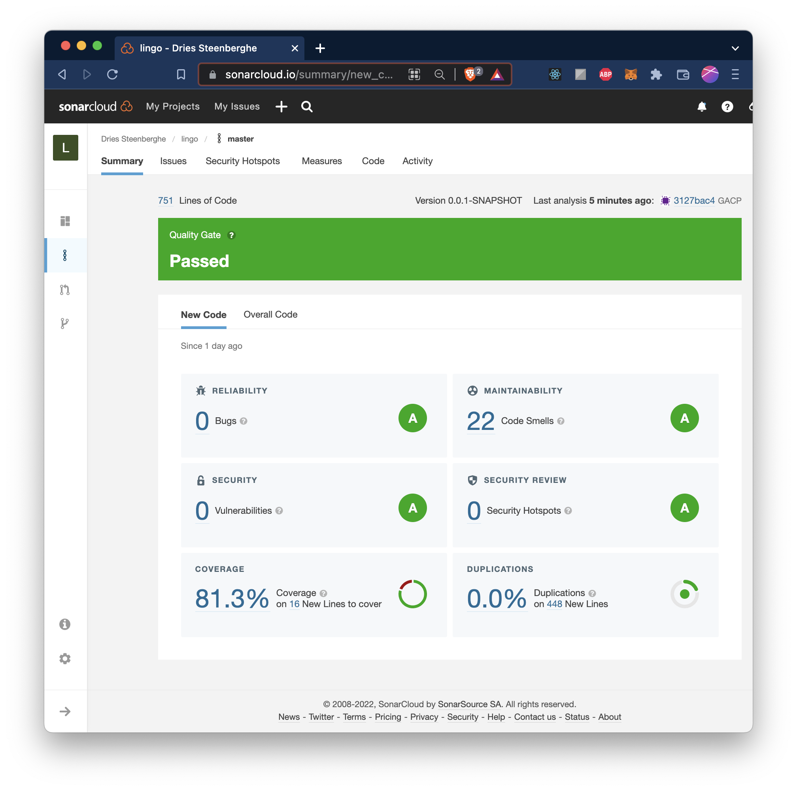
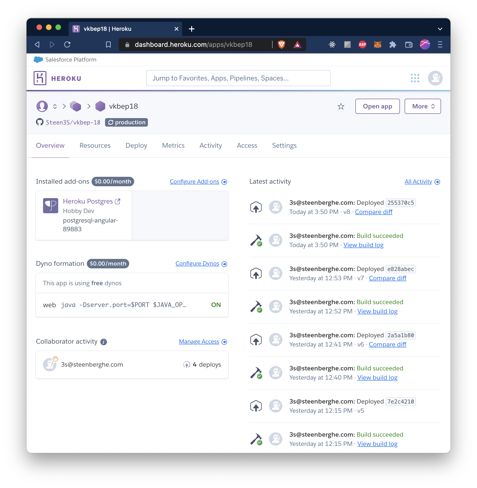

# BEP18 - Lingo Trainer

## Hogeschool Utrecht

[](https://github.com/Steen3S/vkbep-18/actions/workflows/build.yml)
[](https://github.com/Steen3S/vkbep-18/actions/workflows/daily.yml)

### Build

Building the project (docker is mandatory)

```
$ make
```

### Test

Set your sonarqube token in order to run static analyses locally.

```
$ export SONAR_TOKEN=<YOUR_KEY>
```

Afterwards simply run

```
$ make test
```

## Links

[OWASP Analyse](owasp.md)

## Sonar Cloud



## Heroku Deployment


